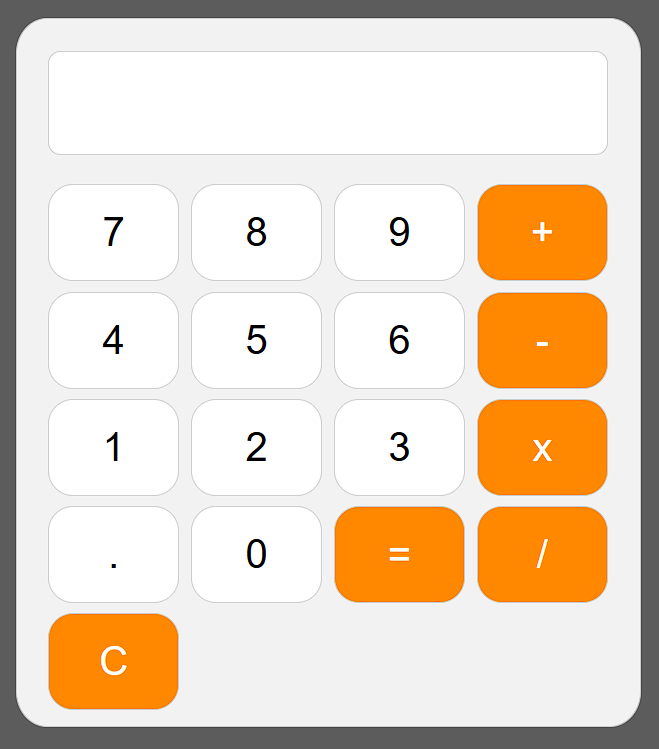

# 🖩 Calculadora Responsiva

Calculadora simples **e responsiva** desenvolvida com **HTML**, **CSS** e **JavaScript**. Funciona em qualquer tamanho de tela, incluindo celular e tablet.

---

## 👀 Preview

👉 **Para visualizar online, [clique aqui](https://gerson-bruno.github.io/estudos/calculadora/)**

---

## 🛠 Tecnologias
- HTML
- CSS
- JavaScript

---

## ⚙️ Funcionalidades
- Interface limpa e intuitiva  
- Todos os botões funcionais  
- Operações básicas: `+`, `-`, `×`, `÷` e `.`  
- Responsiva: se adapta a qualquer tamanho de tela  

---

## 🎯 Objetivo
Projeto criado para treinar **JavaScript**, manipulação do **DOM** e **CSS responsivo**.
