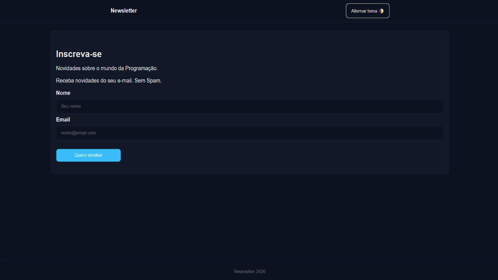

# Newsletter - Formulário com Dark Mode

Projeto de formulário de inscrição para newsletter desenvolvido com HTML, CSS e JavaScript.

A proposta foi praticar criação de formulário simples, manipulação de DOM e implementação de alternância de tema (Light/Dark Mode).

---

## 🔗 Acesse o projeto

👉 **[Clique aqui](https://gerson-bruno.github.io/estudos/html-css/curso-hora-de-codar/form-newlester/)**

---

## 📸 Preview

---

## 🛠 Tecnologias utilizadas

- HTML5
- CSS3
- JavaScript

---

## 📌 Funcionalidades

- Formulário de inscrição (nome e email)
- Alternância de tema (Light/Dark Mode)
- Atualização automática do ano no footer
- Manipulação de atributos no `documentElement`
- Uso de `addEventListener` para interação

---

## 🎯 Objetivo

Treinar:

- Estruturação de formulário com HTML
- Estilização com CSS
- Manipulação de DOM com JavaScript
- Controle de tema utilizando atributos personalizados (`data-tema`)
- Atualização dinâmica de conteúdo (ano atual)

---

## 🚀 Melhorias futuras

- Validação real do formulário
- Feedback visual após envio
- Persistência do tema no `localStorage`
- Melhorias de acessibilidade

