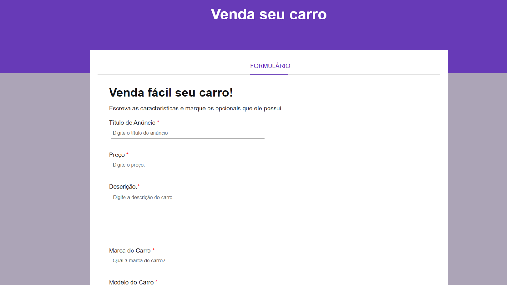

# Formulário - Venda seu carro

Projeto de formulário desenvolvido com HTML e CSS.

A proposta foi praticar a criação de um formulário completo para anúncio de venda de carro, utilizando diferentes tipos de inputs e boas práticas de estruturação.

---

## 🔗 Acesse o projeto

👉 **[Clique aqui](https://gerson-bruno.github.io/estudos/html-css/curso-hora-de-codar/formulario-venda-seu-carro)**

---

## 📸 Preview

---

## 🛠 Tecnologias utilizadas

- HTML5
- CSS3

---

## 📋 Funcionalidades do formulário

- Campo de título do anúncio
- Campo de preço
- Campo de descrição (textarea)
- Marca e modelo
- Quilometragem
- Data de compra
- Seleção de tipo de câmbio (radio button)
- Seleção de opcionais (checkbox)
- Upload de múltiplas imagens
- Validação básica com `required`

---

## 🎯 Objetivo

Treinar:

- Estruturação semântica com HTML
- Criação de formulários completos
- Uso de diferentes tipos de inputs
- Organização visual com CSS
- Aplicação de validações nativas do HTML.

