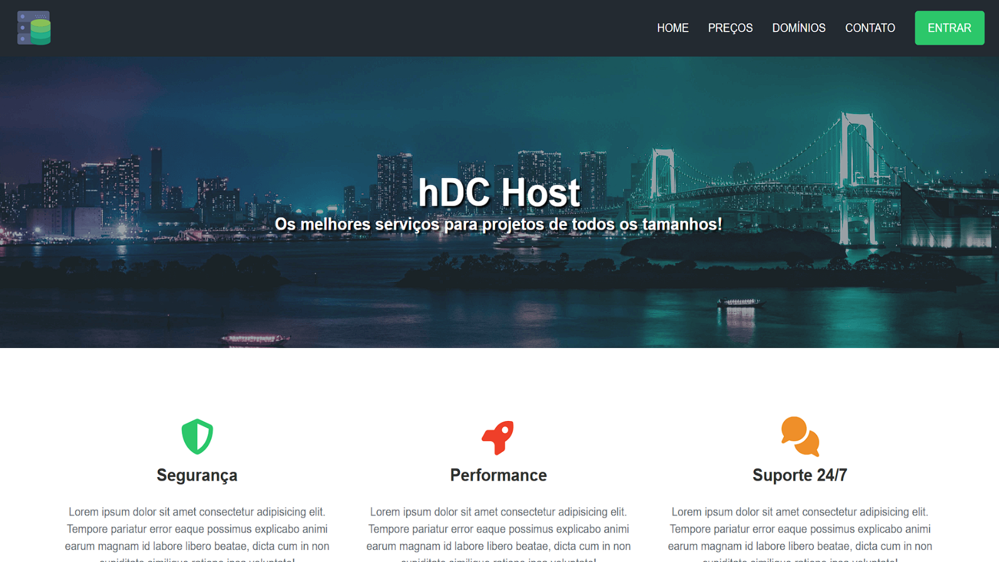

# hDC Host - Landing Page

Landing page desenvolvida para uma empresa fictícia de hospedagem de sites.

O foco do projeto foi simular uma página institucional completa, com seções bem definidas, hierarquia visual clara e estrutura organizada.

---

## 🔗 Acesse o projeto

👉 **[Clique aqui](https://gerson-bruno.github.io/estudos/html-css/curso-hora-de-codar/hdc-host)**

---

## 📸 Preview

---

## 🛠 Tecnologias utilizadas

- HTML5
- CSS3
- Font Awesome (ícones via CDN)

---

## 📌 Estrutura da página

- Navbar com navegação interna
- Hero section (banner principal)
- Seção de serviços
- Seção de planos com destaque visual para plano recomendado
- Busca de domínio
- Formulário de contato
- Footer institucional

---

## 🎯 Decisões técnicas

- Uso de estrutura semântica para melhor organização do conteúdo
- Separação clara entre estrutura (HTML) e estilo (CSS)
- Destaque visual aplicado ao plano mais recomendado para guiar o usuário
- Navegação com âncoras para melhorar usabilidade

---

## 🚀 Melhorias futuras

- Responsividade mais refinada para diferentes breakpoints
- Validação e envio real dos formulários
- Integração com backend ou API simulada
- Melhorias de acessibilidade (aria-labels, foco de teclado, contraste)

