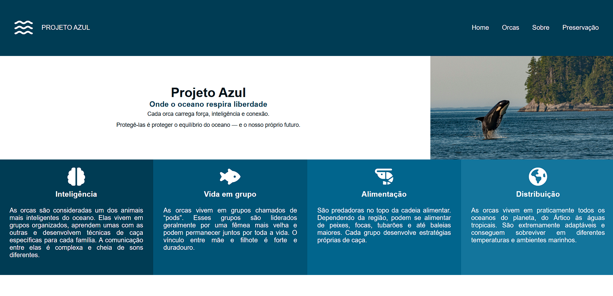

# 🌊 Projeto Azul

## 🐋 Sobre

Minha conexão com as orcas começou na infância. Desde pequeno, algo nelas sempre me chamou atenção — não apenas pela força ou imponência, mas pela presença. Existe algo nas orcas que mistura potência e sensibilidade de um jeito raro.

Com o tempo, essa admiração virou interesse. Depois virou estudo. E hoje virou projeto.  

O **Projeto Azul** nasce dessa paixão antiga. É uma forma de transformar encantamento em expressão. De compartilhar aquilo que sempre me marcou profundamente: o respeito pela inteligência, pela organização e pela beleza desses animais.  

Não é apenas sobre orcas.  
É sobre conexão. Sobre pertencimento ao oceano. Sobre reconhecer que existe grandeza no silêncio das águas profundas. 🌊

---

## ✨ Funcionalidades

- 🖼 **Banner de destaque:** apresenta o projeto e seu slogan com imagem do oceano.  
- 🎨 **Seção de Features:** informações sobre as orcas divididas em cards coloridos.  
- 📚 **Conteúdo sobre Orcas:** textos descritivos detalhando comportamento, comunicação e memória.  
- 👤 **Sobre o criador:** explicação pessoal da motivação e paixão pelas orcas.  
- 🌱 **Preservação:** informações sobre a importância da conservação do oceano e das orcas.  
- 🔗 **Redes sociais:** links do autor para GitHub e LinkedIn.  

---

## 🖥️ Visualização

Para visualizar o site, clique [aqui](https://gerson-bruno.github.io/estudos/html-css/estudos-autorais/projeto-azul/) 👈

---

## 🛠️ Tecnologias Utilizadas

- HTML5  
- CSS3  
- Flexbox  
- Font Awesome  

---

## 💡 Observações

- Projeto desenvolvido do zero, com foco em **layout responsivo e organização de conteúdo**.  
- As cores e disposição refletem a identidade visual do oceano e das orcas.  
- Ideal para portfólio pessoal ou prática de front-end.  
