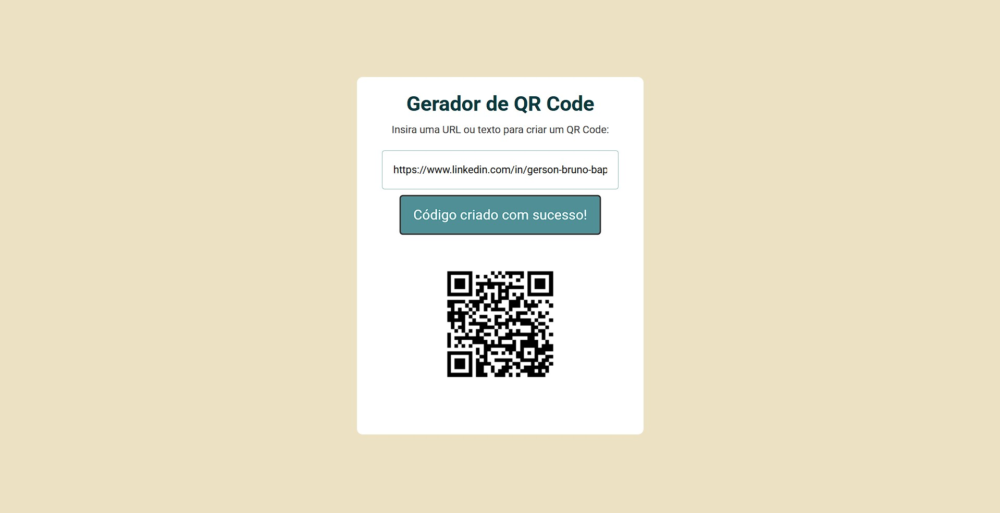

# 📱 Gerador de QR Code

Um projeto **simples e funcional** para gerar QR Codes a partir de qualquer texto ou link. Ideal para quem quer compartilhar informações rapidamente usando QR Codes. O projeto utiliza **HTML, CSS, JavaScript** e a **API do [goqr.me](https://goqr.me/api/)**.

---

## 🌐 Acesso Online

Para testar o projeto, clique aqui: [🔗 Acesse o Gerador de QR Code](https://gerson-bruno.github.io/estudos/javascript/curso-hora-de-codar/projetos/gerador-qr-code)

---

## 🚀 Funcionalidades

- 📝 Gera QR Code a partir de qualquer texto ou URL  
- 🔄 Atualização do QR Code em tempo real  
- 🎨 Layout limpo, responsivo e fácil de usar  
- 🌐 Integração direta com a API do goqr.me  

---

## 💻 Tecnologias

- **HTML5** – Estrutura do site  
- **CSS3** – Estilo e responsividade  
- **JavaScript** – Lógica para gerar QR Codes  
- **API**: [goqr.me](https://goqr.me/api/) – Geração do QR Code  

---

Projeto feito por: [Gerson Bruno](https://github.com/gerson-bruno).

