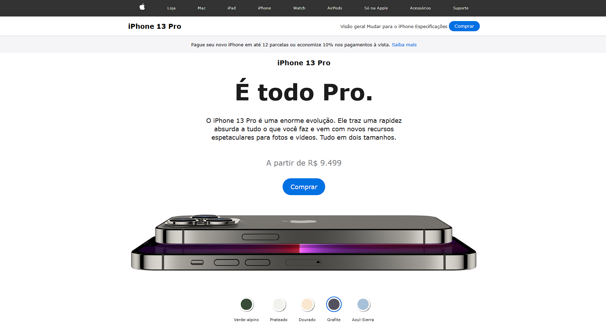

# 📱 iPhone 13 Pro - Página Interativa

## 🖼️ Preview do Projeto

🔗 **Acessar o projeto:**
👉 **[Clique aqui](https://gerson-bruno.github.io/estudos/javascript/curso-hora-de-codar/projetos/iphone-13/)**

---

## 📖 Sobre o projeto

Recriação de uma página de apresentação do **iPhone 13 Pro**, inspirada no site oficial da Apple.

A interface permite **trocar a cor do aparelho**, atualizando a imagem dinamicamente com **JavaScript**.

Projeto feito para praticar:

* Manipulação do **DOM**
* **Eventos de clique**
* **Atualização dinâmica de imagens**
* **Estruturação de layout**

---

## 🛠️ Tecnologias utilizadas

* HTML5
* CSS3
* JavaScript (Vanilla JS)

---

## ⚙️ Funcionalidades

✔️ Troca de cor do iPhone
✔️ Atualização dinâmica da imagem
✔️ Pequena animação na troca de imagem
✔️ Layout inspirado no site da Apple
✔️ Responsividade básica

---

## 👨‍💻 Autor

**Gerson Bruno**

Projeto desenvolvido durante meus estudos em **Desenvolvimento Web** do Curso Hora de Codar.
