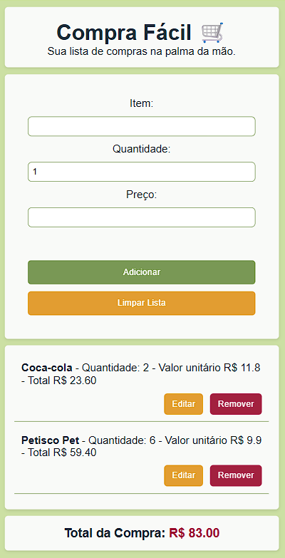

# 🛒 Compra Fácil

**Sua lista de compras na palma da mão.**

---

## 📱 Sobre o projeto

Criei o **Compra Fácil** pensando principalmente no uso no celular (mas ele é acessível e funcional para usar em qualquer dispositivo).
A ideia é simples: você estar no mercado e conseguir controlar melhor o que está comprando e quanto está gastando, sem complicação.

O aplicativo permite adicionar, editar e remover itens, além de calcular automaticamente o total da compra.

---

## 🚀 Acesse o projeto

👉 [Clique aqui para acessar](https://gerson-bruno.github.io/estudos/javascript/estudos-autorais/calculadora-de-compras/)

---

## 🖼️ Preview

---

## ⚙️ Funcionalidades

* Adicionar itens com quantidade e preço
* Editar itens da lista
* Remover itens
* Cálculo automático do total
* Salvamento no navegador (LocalStorage)
* Layout responsivo (funciona bem no celular)

---

## 🛠️ Tecnologias utilizadas

* HTML
* CSS
* JavaScript

---

## 💬 Observação

Esse projeto foi desenvolvido como parte dos meus estudos em desenvolvimento front-end, com foco em prática real e usabilidade no dia a dia.

