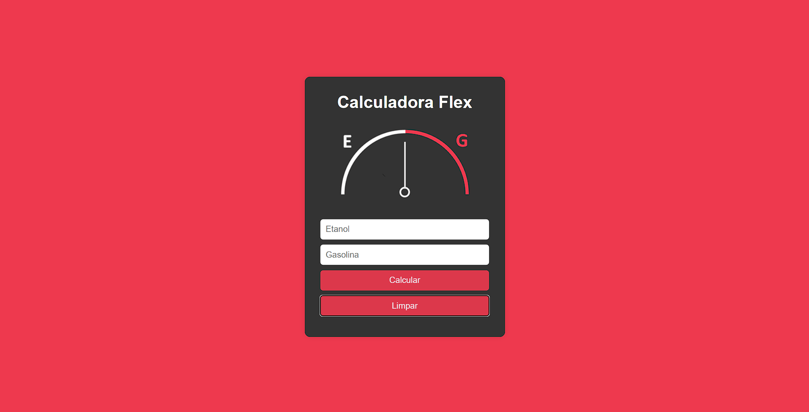

# 🚗 Calculadora Flex

Uma calculadora simples pra te ajudar a decidir se vale mais a pena abastecer com **Etanol** ou **Gasolina**.  

---

## 🔹 Preview

---

## 🌐 Acesse Online

[Veja a calculadora funcionando aqui](https://gerson-bruno.github.io/estudos/javascript/estudos-autorais/calculadora-flex)  

---

## 💻 Funcionalidades

- 🛢️ Insira o preço do **Etanol** e da **Gasolina**.  
- 📊 Calcula automaticamente a proporção.  
- ⚡ Mostra a **imagem correspondente**: Etanol ou Gasolina.  
- ✨ Limpa os inputs depois de calcular.  

---

## 🛠️ Como usar

1. Abra o `index.html` no navegador.  
2. Digite o valor do **Etanol** e da **Gasolina**.  
3. Clique em **Calcular**.  
4. Veja qual combustível vale mais a pena.  

---

## 💡 Regras de cálculo

- Se `(Etanol / Gasolina) < 0.7` → vale mais o **Etanol**.  
- Caso contrário → vale mais a **Gasolina**.  

