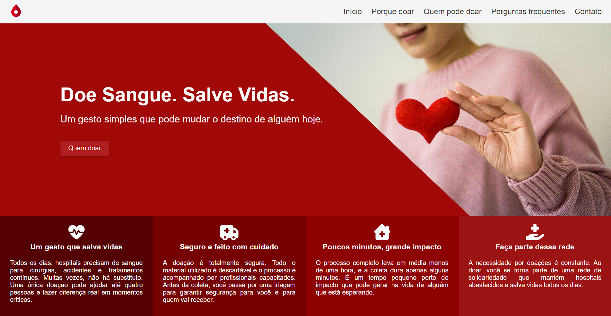

# 🩸 Doe Sangue. Salve Vidas.

Landing page informativa sobre doação de sangue com verificação dinâmica de compatibilidade sanguínea.

Projeto desenvolvido com foco em **estrutura semântica, manipulação de DOM, organização de código e responsividade**.

---

## 🔗 Visualização do Projeto

👉 **[Clique aqui para visualizar o projeto](https://gerson-bruno.github.io/estudos/javascript/estudos-autorais/doe-sangue-salve-vidas/)**

---

## 📷 Preview

---

## 🚀 Tecnologias Utilizadas

* HTML5 (estrutura semântica)
* CSS3 (Flexbox + Media Queries)
* JavaScript (DOM, eventos e lógica condicional)

---

## ⚙️ Funcionalidades

* Layout totalmente responsivo
* Verificação dinâmica de compatibilidade sanguínea
* Atualização automática do ano no rodapé
* Simulação de envio de formulário
* Código com nomenclatura padronizada em inglês

---

## 🎯 Objetivo do Projeto

Este projeto foi desenvolvido como parte dos meus estudos em JavaScript, com foco em:

* Manipulação do DOM
* Estruturação de layout responsivo
* Organização e padronização de código
* Boas práticas de nomenclatura
* Separação clara entre HTML, CSS e JS

---

## 📌 Aprendizados Aplicados

* Uso de objetos para estruturar dados
* EventListener para controle de formulário
* Media Queries para adaptação mobile
* Refatoração de classes e IDs para padrão internacional
* Estrutura limpa e escalável

---

## 📎 Status

✔️ Finalizado
✔️ Responsivo
✔️ Publicado via GitHub Pages

---

## 👨‍💻 Autor

Desenvolvido por **Gerson Bruno**

