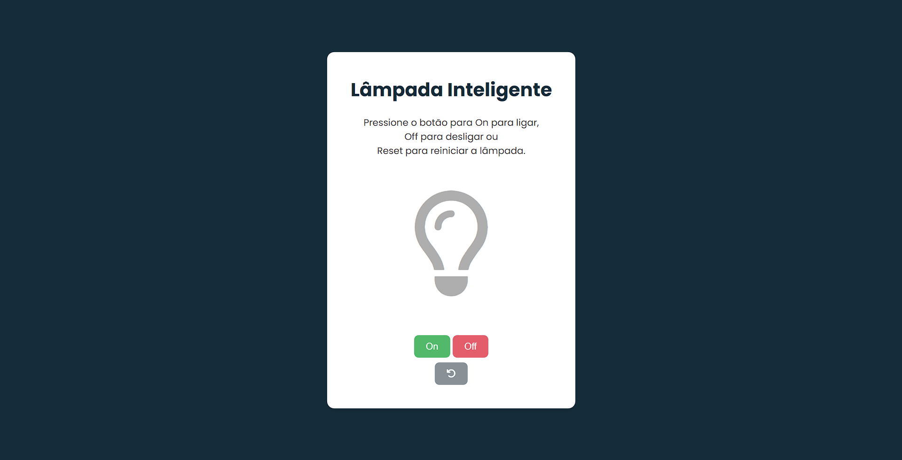

# 💡 Lâmpada Inteligente

Projeto simples feito com HTML, CSS e JavaScript para simular o funcionamento de uma lâmpada interativa.

A ideia aqui é treinar manipulação de DOM, eventos e classes no JS de forma prática e visual.

---

## 🔗 Acesse o projeto

👉 [Clique aqui](https://gerson-bruno.github.io/estudos/javascript/estudos-autorais/lampada/)

---

## 📸 Preview

---

## ⚙️ Funcionalidades

- Botão **On** → liga a lâmpada
- Botão **Off** → desliga a lâmpada
- Botão **Reset** → volta ao estado inicial
- Feedback visual com mudança de cor e efeito de brilho

---

## 🧠 O que foi praticado

- Manipulação de classes com `classList`
- Eventos de clique (`addEventListener`)
- Organização básica de código
- Estilização com CSS (hover, sombra, transições)

---

## 🛠️ Tecnologias usadas

- HTML5
- CSS3
- JavaScript
- Font Awesome (ícones)

---

## 📁 Estrutura
📦 lampada

┣ 📜 index.html

┣ 📜 style.css

┣ 📜 script.js

┣ 🖼️ preview.png

---

## 🚀 Observação

Projeto simples, para melhorar o entendimento de como criar interações com elementos na tela.
