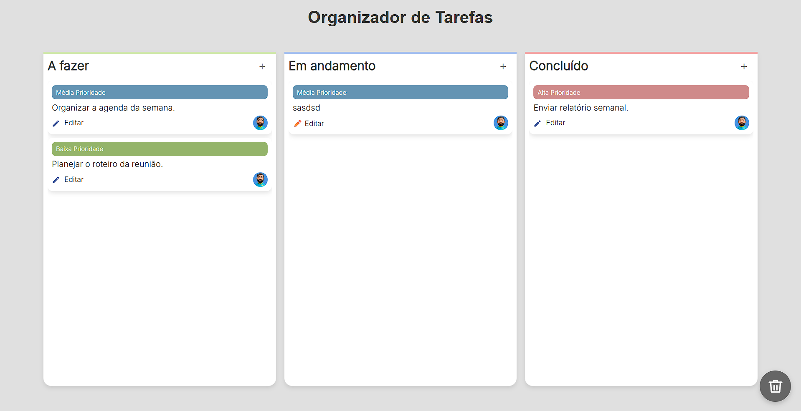

# 🗂️ Organizador de Tarefas

Um quadro Kanban simples para gerenciamento de tarefas, feito em **HTML, CSS e JavaScript puro**. Ideal para organizar atividades do dia a dia, estudos ou projetos pessoais.

---

## ⚡ Funcionalidades

- 📝 Adicionar tarefas em colunas: **A Fazer**, **Em andamento** e **Concluído** 
- ✏️ Editar tarefas existentes  
- 🗑️ Arrastar tarefas para a lixeira para remover  
- 🔖 Definir prioridade: **Baixa**, **Média**, **Alta**  
- 🎨 Interface moderna e responsiva, com cores suaves  

---

## 📸 Preview

---

## 🚀 Acesso Online

Você pode testar a aplicação [clicando aqui](https://gerson-bruno.github.io/estudos/javascript/estudos-autorais/organizador-de-tarefas/)

---

## 🛠️ Tecnologias

- HTML5  
- CSS3  
- JavaScript (ES6)  

