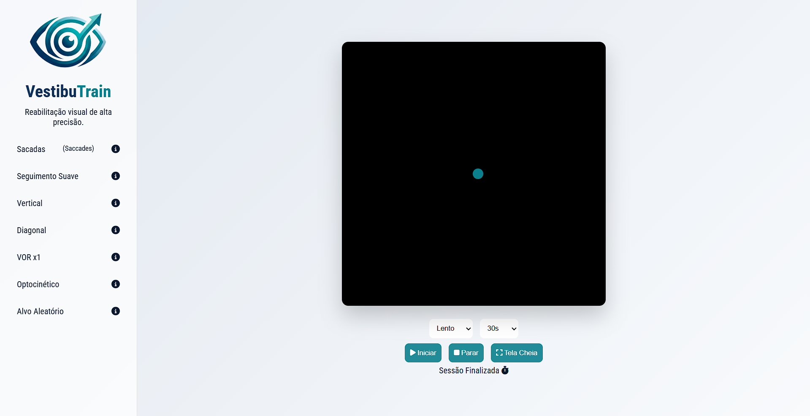

# 👁️ VestibuTrain - Reabilitação Visual & Vestibular

O **VestibuTrain** é uma ferramenta interativa desenvolvida em JavaScript voltada para o treinamento e reabilitação ocular. O projeto foi projetado para auxiliar em protocolos de fisioterapia visual, auxiliando pacientes com hipofunção vestibular, tonturas, dificuldades de rastreio e déficits de atenção visual.

🚀 **Acesse o projeto:** [VestibuTrain Online](https://gerson-bruno.github.io/estudos/javascript/estudos-autorais/reabilitacao-visual/)

## 🎯 Objetivo
O software simula exercícios oculares clássicos utilizados em clínicas de reabilitação, permitindo que o usuário treine a musculatura ocular e o reflexo vestíbulo-ocular (VOR) de forma controlada, ajustando velocidade e tempo de execução.

## 🛠️ Funcionalidades e Exercícios

O programa conta com 7 modalidades específicas:

* **Sacadas (Saccades):** Movimentos rápidos entre dois pontos para treinar a velocidade de troca de foco.
* **Seguimento Suave (Smooth):** Movimento contínuo para trabalhar a estabilidade visual.
* **Vertical:** Fortalecimento dos músculos retos superiores e inferiores.
* **Diagonal (Movimento em X):** Cruzamento de eixos para coordenação complexa de músculos oblíquos.
* **VOR x1:** Foco fixo central para exercícios de estabilização com movimento de cabeça.
* **Optocinético:** Estimulação periférica para dessensibilização visual e adaptação.
* **Alvo Aleatório:** Treino de tempo de reação e atenção visual.

## ⚙️ Características Técnicas

* **Responsividade Fullscreen:** O algoritmo de animação detecta automaticamente o tamanho da tela e ajusta a proporção do movimento (especialmente no modo Diagonal) para garantir um trajeto perfeito em qualquer monitor.
* **Motor de Animação:** Utiliza `requestAnimationFrame` para garantir movimentos fluidos de 60 FPS, essenciais para não causar desconforto visual (nauseas) por saltos de frames.
* **Customização:** Opções de velocidade (Lento, Médio, Rápido) e cronômetro regressivo.

## 🛠️ Tecnologias Utilizadas

* **HTML5** (Estrutura e Semântica)
* **CSS3** (Layout Flexbox, Animações e Efeitos Neon)
* **JavaScript Vanilla** (Lógica de física, detecção de colisão e manipulação de DOM)

## 📂 Como usar

1. Selecione o tipo de exercício no menu lateral.
2. Ajuste a **Velocidade** e o **Tempo** desejados nos seletores inferiores.
3. (Opcional) Clique em **Tela Cheia** para eliminar distrações visuais periféricas.
4. Clique em **Iniciar**.
5. Para saber mais sobre a indicação de cada exercício, clique no ícone de informação 'i' ao lado do nome.

---
Desenvolvido por [Gerson Bruno](https://github.com/gerson-bruno)
