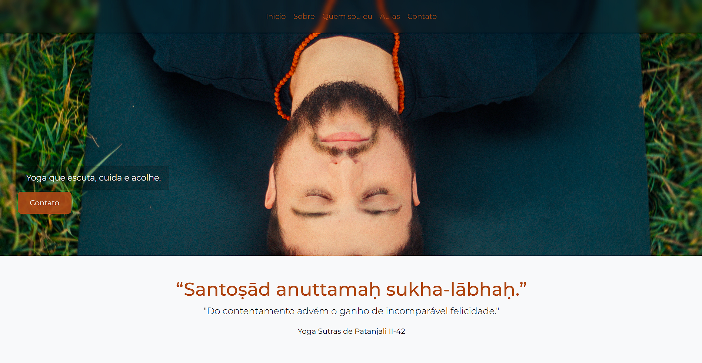

# 🧘‍♂️ Landing Page - Gerson Yoga

Landing page desenvolvida para apresentar e divulgar meu trabalho como professor de yoga.

O projeto tem como foco transmitir a essência do yoga de forma mais profunda, indo além da abordagem comum voltada apenas para o físico. A proposta é comunicar uma visão mais consciente da prática, unindo estética, clareza e identidade.

---

## 📷 Preview

---

## 🔗 Acesso

👉 https://gerson-bruno.github.io/estudos/javascript/estudos-autorais/yoga/

---

## 📌 Sobre o projeto

- Página única (landing page)
- Estrutura simples, direta e objetiva
- Conteúdo autoral com abordagem filosófica do yoga
- Layout responsivo e limpo
- Foco em leitura confortável e experiência do usuário

---

## 🚀 Tecnologias utilizadas

- HTML5  
- CSS3  
- JavaScript  
- Bootstrap  

---

## 🎯 Objetivo

Criar uma presença online clara e profissional para apresentar:

- O que é yoga sob uma perspectiva mais profunda  
- Minha trajetória como professor  
- Como funcionam minhas aulas  
- Formas de contato  

---

## 📞 Contato

- WhatsApp: (16) 99235-4138  
- Instagram: @gerson.yoga  