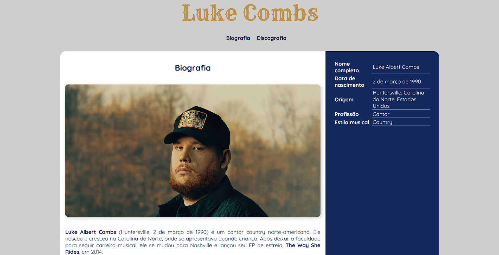

# Luke Combs | Biografia e Discografia

Projeto acadêmico desenvolvido para a disciplina de Desenvolvimento Web, com foco na aplicação prática de HTML5 e CSS3 na construção de uma página estática estruturada e responsiva.

---

## 🔗 Acesso ao Projeto

Você pode visualizar a página [aqui](https://gerson-bruno.github.io/estudos/luke-combs).

---

## 🖼 Preview

---

## 📌 Objetivo

Implementar uma página institucional estática aplicando:

- Estrutura semântica com HTML5
- Layout com Flexbox
- Responsividade com Media Queries
- Boas práticas de organização de CSS
- Navegação interna com âncoras
- Microinterações com pseudo-elementos

---

## 🛠 Stack Utilizada

- HTML5
- CSS3
- Google Fonts (Quicksand e Rye)

---

### ✔ Estrutura Semântica

Uso de:
- `<header>`
- `<main>`
- `<section>`
- `<article>`
- `<aside>`
- `<footer>`

Organização voltada à clareza estrutural e separação de responsabilidades.

---

### ✔ Layout

- Flexbox para distribuição entre conteúdo principal e sidebar  
- Controle de largura proporcional (70% / 30%)  
- Centralização com margin auto  
- Border-radius aplicado estrategicamente para diferenciação visual  

---

### ✔ Responsividade

- Media Query em `max-width: 768px`  
- Reorganização do layout em coluna única  
- Ajuste de largura para 100% em dispositivos menores  

---

### ✔ Microinterações

- Scroll suave com `scroll-behavior: smooth`  
- Underline animado no menu utilizando `::after` e `transition`  
- Uso de `object-fit: cover` para controle de imagens  

---

## 🎯 Finalidade

Projeto voltado para consolidação de fundamentos em desenvolvimento front-end, com foco em estrutura, organização e responsividade.

---

## 📈 Possíveis Evoluções

- Refatoração para abordagem mobile-first  
- Implementação com CSS Grid  
- Melhoria de acessibilidade (ARIA / foco visível)   
- Componentização futura com framework (React, por exemplo)  

---

Desenvolvido para fins acadêmicos.