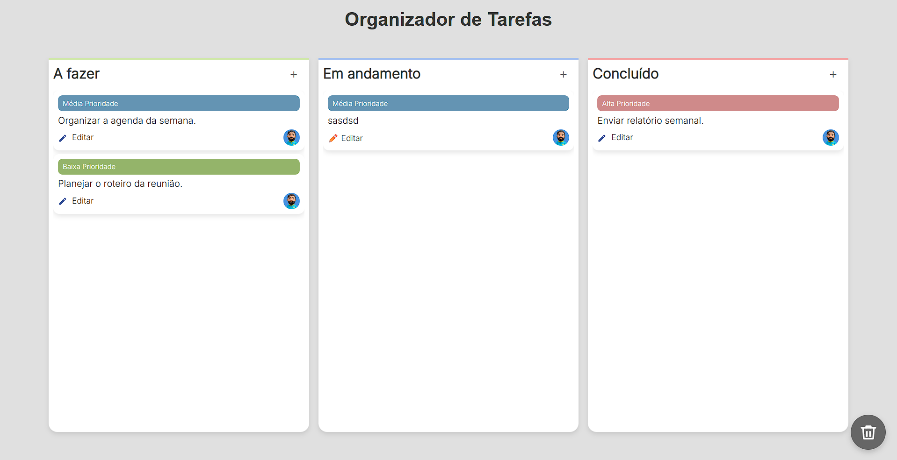

# Organizador de Tarefas

Organizador de tarefas estilo Kanban, feito com **HTML, CSS e JavaScript puro**. Permite criar, editar, mover e deletar tarefas entre colunas "A Fazer", "Fazendo" e "Finalizado", além de uma lixeira para exclusão arrastando os cards. Ideal para organização pessoal e aprendizado de front-end.

## Funcionalidades

- Adição de tarefas via modal
- Edição de tarefas existentes
- Arrastar e soltar tarefas entre colunas
- Lixeira para exclusão de tarefas com confirmação
- Sistema de prioridade (Baixa, Média e Alta)
- Responsivo e visual clean
- Cards com cores suaves para diferentes prioridades

## Tecnologias

- HTML5
- CSS3 (Flexbox, Gradientes e Custom Scroll)
- JavaScript (Drag & Drop, DOM Manipulation)

## Como Acessar

Você pode acessar a versão online aqui:  
[Organizador de Tarefas](https://gerson-bruno.github.io/estudos/organizador-de-tarefas/)

